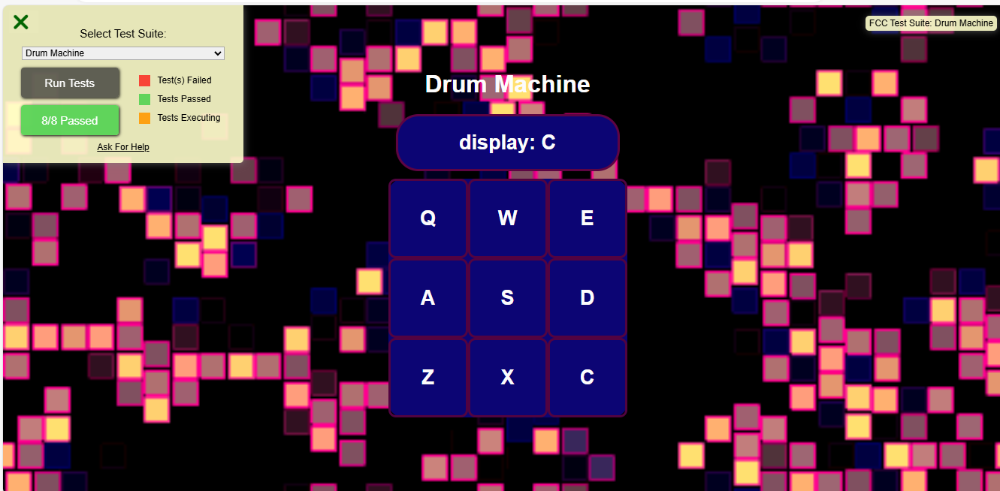
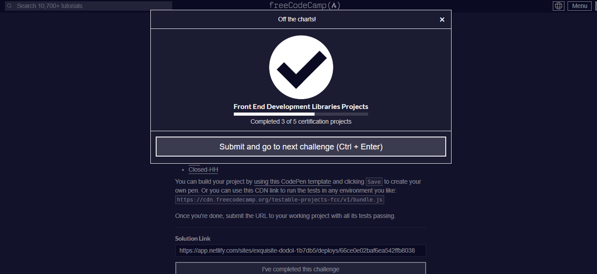

# Drum Machine

This is a drum machine application that allows users to play various drum sounds by clicking on the drum pads or pressing the corresponding keyboard keys.

## User Stories

1. **Outer Container**: I should be able to see an outer container with a corresponding `id="drum-machine"` that contains all other elements.
2. **Display Element**: Within `#drum-machine` I can see an element with a corresponding `id="display"`.
3. **Drum Pads**: Within `#drum-machine` I can see 9 clickable drum pad elements, each with a class name of `drum-pad`, a unique `id` that describes the audio clip the drum pad will be set up to trigger, and an inner text that corresponds to one of the following keys on the keyboard: `Q`, `W`, `E`, `A`, `S`, `D`, `Z`, `X`, `C`. The drum pads MUST be in this order.
4. **Audio Elements**: Within each `.drum-pad`, there should be an HTML5 `audio` element which has a `src` attribute pointing to an audio clip, a class name of `clip`, and an `id` corresponding to the inner text of its parent `.drum-pad` (e.g. `id="Q"`, `id="W"`, `id="E"` etc.).
5. **Click Triggering**: When I click on a `.drum-pad` element, the audio clip contained in its child `audio` element should be triggered.
6. **Keyboard Triggering**: When I press the trigger key associated with each `.drum-pad`, the audio clip contained in its child `audio` element should be triggered (e.g. pressing the `Q` key should trigger the drum pad which contains the string `Q`, pressing the `W` key should trigger the drum pad which contains the string `W`, etc.).
7. **Display Update**: When a `.drum-pad` is triggered, a string describing the associated audio clip is displayed as the inner text of the `#display` element (each string must be unique).

## Technologies Used

- HTML
- CSS
- JavaScript
- React js

## Demo 📸

 
 [Live-link](https://drum-machine--exquisite-dodol-1b7db5.netlify.app/)

## Features ⭐

- Play various drum sounds by clicking on the drum pads or pressing the corresponding keyboard keys.
- The current drum sound being played is displayed in the `#display` element.
- Responsive design that adapts to different screen sizes.

## How to Run the Project
1. Clone the repository to your local machine.
2. Install the dependencies by running `npm install` or `yarn install`.
3. Start the development server by running `npm start` or `yarn start`.
4. Open your web browser and navigate to `http://localhost:3000` to view the Markdown previewer.

## Testing
All the required user stories and tests have been successfully completed and passed.

## Acknowledgments 📝
This project was built as part of the FreeCodeCamp curriculum. The project requirements and the provided Markdown previewer example were sourced from the FreeCodeCamp website.

## Author 👩‍💻
- Website: [website.com]( https://drum-machine--exquisite-dodol-1b7db5.netlify.app/)
- LinkedIn: [Mehria saqibi](https://www.linkedin.com/in/mehria-saqibi-a386a41a1?utm_source=share&utm_campaign=share_via&utm_content=profile&utm_medium=android_app)
- Email: [email](mosawermh@gmail.com)

## Contributing 🤝

Contributions are welcome! If you'd like to contribute, please fork the repository and create a pull request. Ensure that your code follows the project's coding standards and guidelines.